# SSR manual

## Preliminary
约法三章：
1. 本着自由平等公正公开的原则，本账号仅限cyk好友使用，
2. ，不得假借给其他人一天以上。
3. 
## Desktop Configuration
SSR支持多平台，包括MacOSX，Linux，Windows，配置方法如下。

### Windows下安装步骤
1. 下载zip压缩包，并解压
[Win客户端下载链接](https://github.com/shadowsocks/shadowsocks-windows/releases/download/4.1.7.1/Shadowsocks-4.1.7.1.zip)
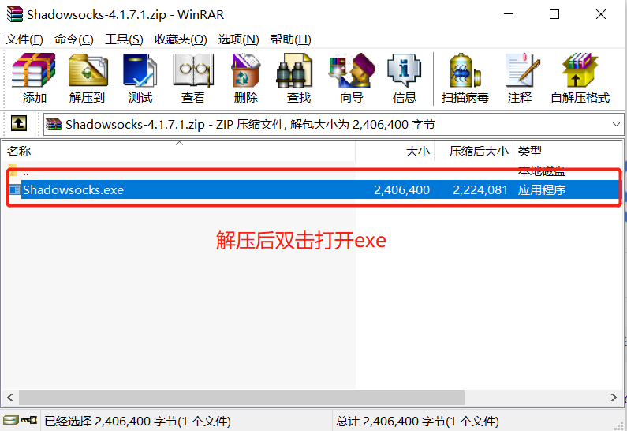
2. 双击exe文件打开，在任务栏右下角找到飞机状图标双击打开
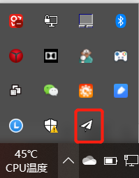
1. 复制ss口令, 格式: “ss://YWVzLxxxxxxxxxxxxxxxxxx” 到剪切板，然后如下图所示，从剪切板导入
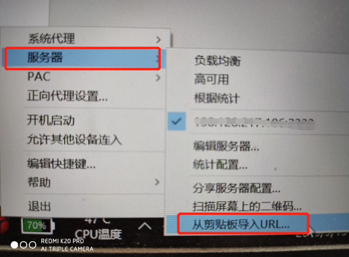
4. 修改系统代理模式为PAC模式，如下图所示
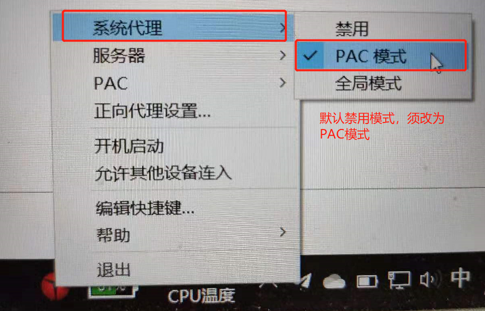
5. 如图，在服务器选项中，确保导入的配置被选中。
6. 配置成功。欢迎来到墙外的世界！

### MacOSX
1. OSX系统下，下载。安装并启动该客户端
[MaxOSX客户端下载链接]（https://github.com/shadowsocks/ShadowsocksX-NG/releases/download/v1.8.2/ShadowsocksX-NG.app.1.8.2.zip）
2. 复制ss口令, 格式: “ss://YWVzLxxxxxxxxxxxxxxxxxx” 到系统剪切板。
3. 在桌面右上角任务栏找到飞机形状图标，如下图所式。点击该图标. 选中 "Import Server URLs from Pasteboard"
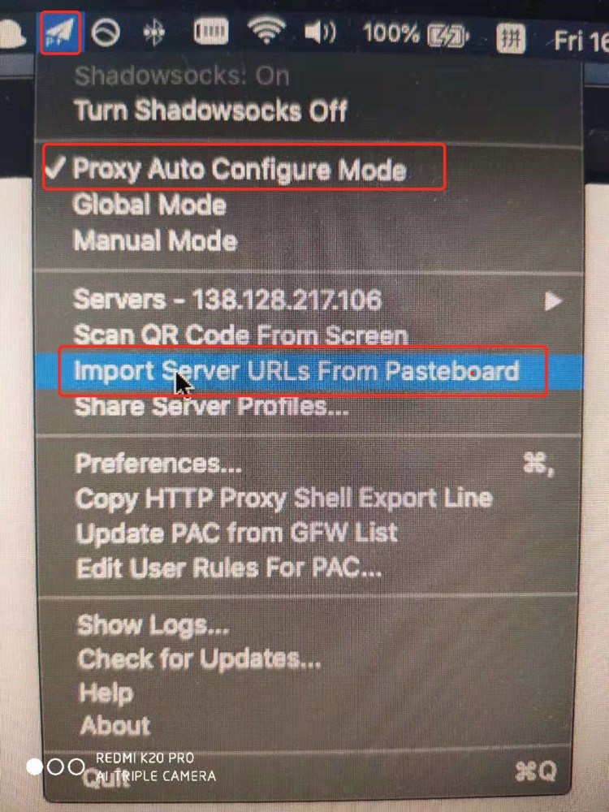
4. 同时在第二栏选择 Proxy Auto Configure Mode
5. 如下图，在server栏确保刚才导入的服务器信息被勾选。
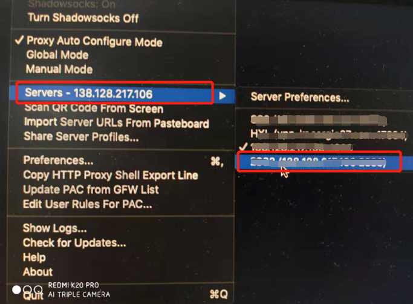
6. 连接成功！欢迎来到外面的世界！

### Linux
可参考如下[教程](https://zhuanlan.zhihu.com/p/47706985)。后面会更新。

## Mobile Configuration
### Android
1. 下载方式三选一，下载后在安卓手机上安装
[apk安装包下载](https://github.com/shadowsocks/shadowsocks-android/releases/download/v4.8.3/shadowsocks--universal-4.8.3.apk)
[Google Play下载链接](https://play.google.com/store/apps/details?id=com.github.shadowsocks)
[Outline安卓客户端下载链接](https://github.com/Jigsaw-Code/outline-releases/blob/master/client/Outline.apk?raw=true)
2. 
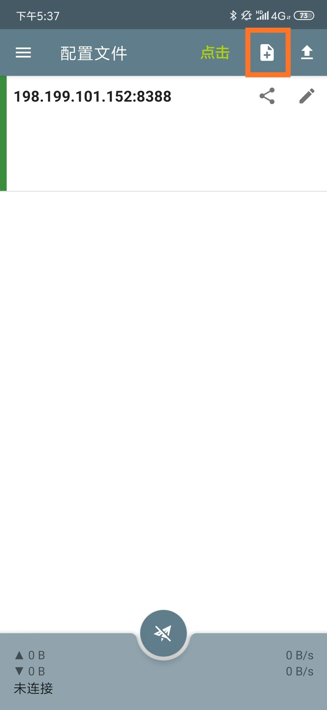
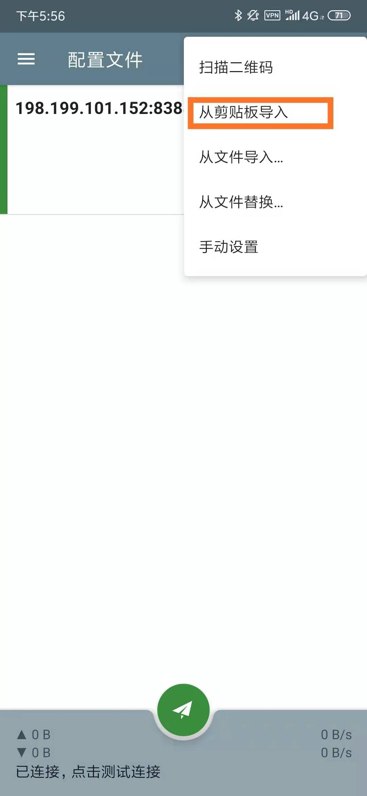
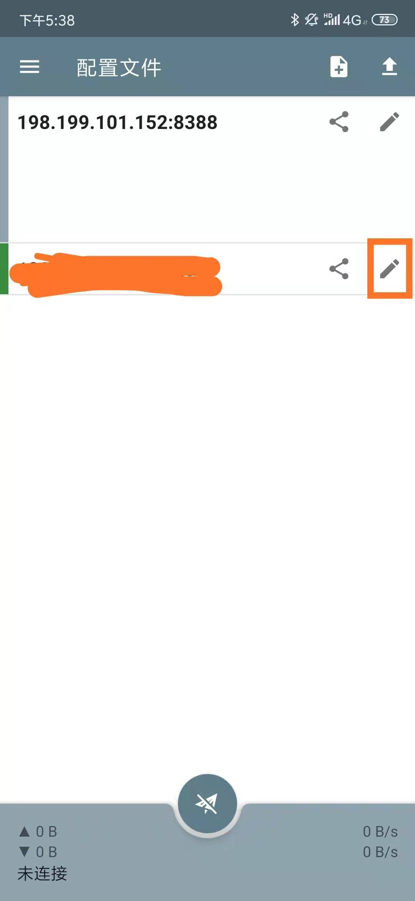
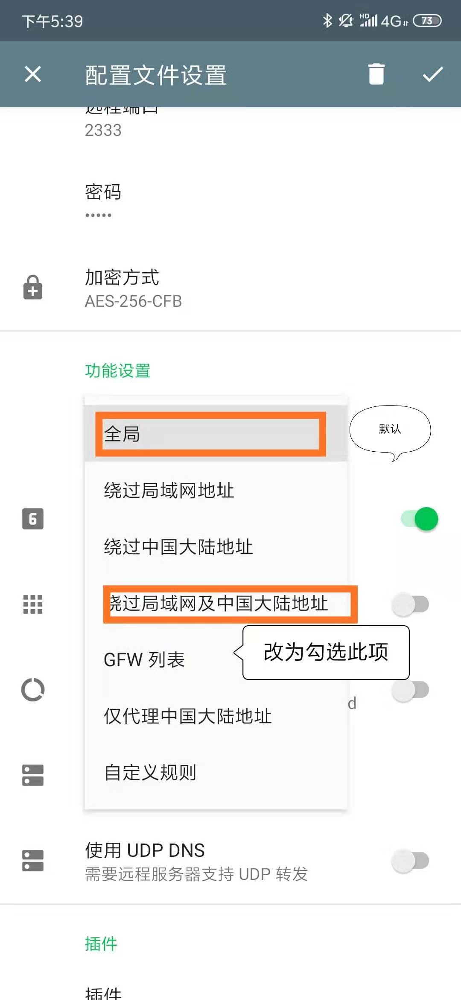
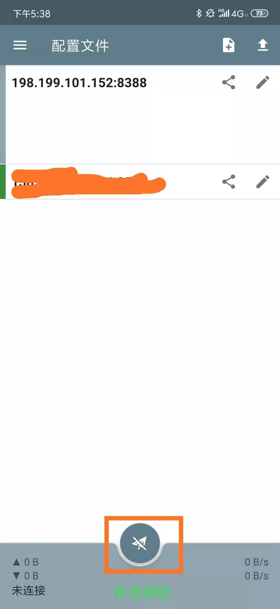
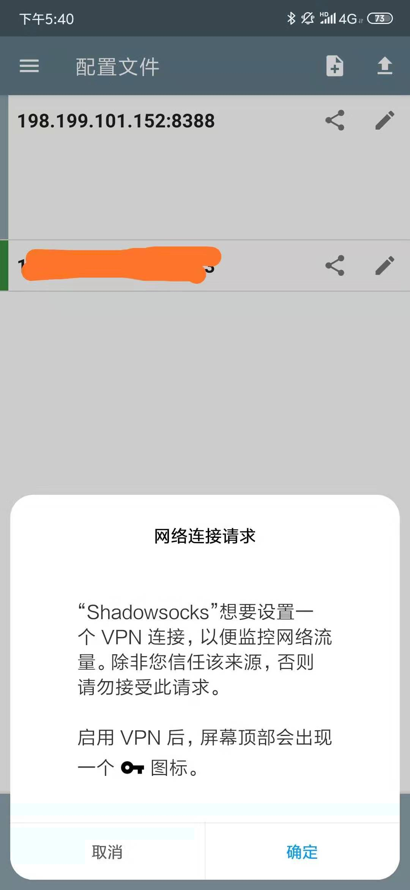

### iPhone
